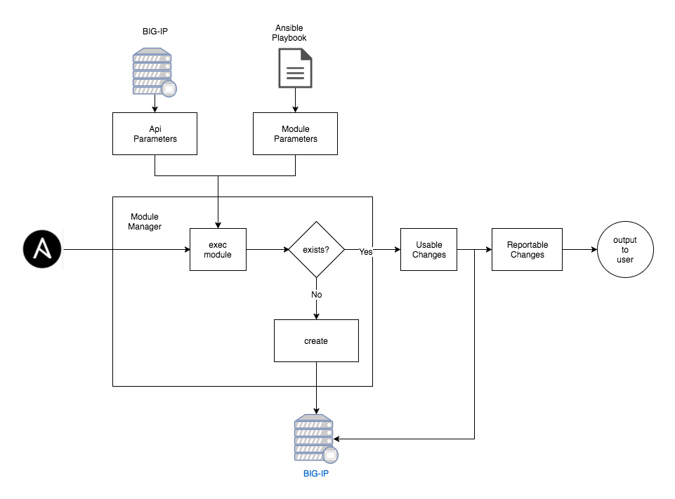

Tutorial: Writing a module
==========================

The following tutorial explains how to create an F5 module for Ansible. This tutorial shows what is necessary to re-create the ``bigip_policy_rule`` module, which was released in Ansible 2.5. This module is a core part of LTM policy manipulation and, therefore, a crucial component of BIG-IP automation.

The module that you will re-create is considered to be an advanced module. It is, however, the one that illustrates all pieces of the current coding conventions. So it is useful to see the standards in their completeness instead of illustrating many different
modules.

This tutorial is split up into a number of different sections. Feel free to jump to any section for a reference.

.. toctree::
   :maxdepth: 1
   :includehidden:

   requirements
   stubbing-module-fragments
   documentation-var
   examples-var
   return-var
   import-block
   argument-spec
   module-manager
   parameters
   difference
   changes
   main-function
   testing

General module design
---------------------

This document discusses module development for the F5 Modules for Ansible.

As you follow the tutorial, you can use the following image to visualize how things are connected.

This image shows a high-level view of what happens when a module executes. In general, the module is a pipeline that moves from the left side of the diagram to the right side of the diagram. You should keep this diagram nearby as the tutorial moves on to more code-heavy topics.
