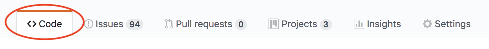
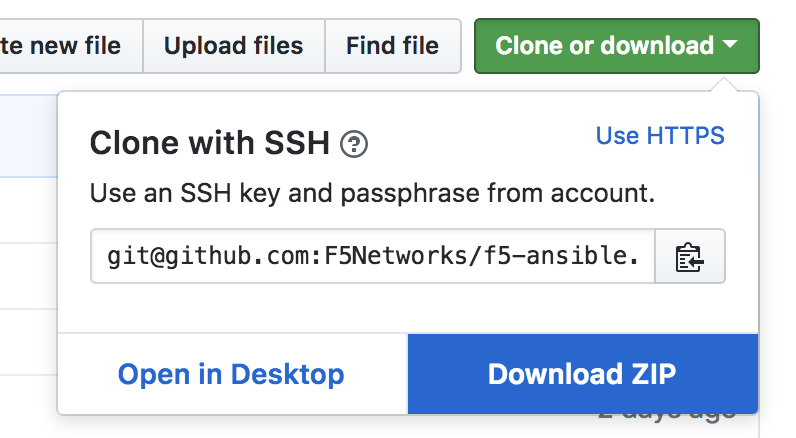

.. _installunstable:

Install experimental F5 Modules
===============================

When you install Ansible, it includes F5 modules.

Other F5 modules are not installed when you install Ansible. These modules are experimental and live in GitHub.

You might need to use experimental modules when you want to test something, or when you just can't wait for a module to be upstreamed to Ansible.

You can install experimental modules on your system in one of a few ways.

Method 1: Install in a relative location (recommended)
------------------------------------------------------

Ansible allows you to put modules in a location that is relative to the project you are working on. To accomplish this, follow the instructions
below.

ansible.cfg creation/configuration
^^^^^^^^^^^^^^^^^^^^^^^^^^^^^^^^^^

First, ensure that an ``ansible.cfg`` file exists in the directory that you run Ansible from.

Inside the ``ansible.cfg`` file, add the following code.

.. code-block:: yaml

   [defaults]
   library = ./library/modules
   module_utils = ./library/module_utils
   action_plugins = ./library/plugins/action
   terminal_plugins = ./library/plugins/terminal
   network_group_modules = bigip, bigiq

This code instructs Ansible to look for modules in a directory called ``library/modules/`` that is relative to where the ``ansible.cfg`` file exists.
Additionally, it instructs Ansible to look for supporting "module utils" in the ``library/module_utils/`` directory. The same redirection is done with Ansible's
action plugins via the ``action_plugins`` configuration parameter. Finally, we tell Ansible that there the ``bigip`` and ``bigiq`` modules are considered
"networking" modules. This changes the behavior of Ansible slightly when it invokes action plugins.

.. note::

    Specifying a ``library`` directory does not override the system location where Ansible searches for modules. It only tells Ansible to "look here first" when
    importing a module. Therefore, if a module in the specified ``library`` directory does not exist, Ansible will fall back to the system location and look for
    the module there.

You can also specify multiple locations by separating them with a colon. For example, if you have two different directories with two different sets of modules
in them, you might do something like this:

.. code-block:: yaml

   [defaults]
   library=./library:./unstable

In this example, when looking for a module named ``foo.py``, Ansible follows this order:

1. ``./library/foo.py``
2. ``./unstable/foo.py``
3. Recursively through ``/usr/local/lib/PYTHON_VERSION/site-packages/ansible/modules/``

Get the source
^^^^^^^^^^^^^^

Next, you must get the contents of the ``f5-ansible`` `Github repository`_. This can be done in either of two ways.

In the same directory that you have created the ``ansible.cfg`` file, choose one of the following methods.

Via a git clone (recommended)
`````````````````````````````

This method will allow you to both

1. Get the source code
2. Update the source code easily

Therefore, it is the recommended approach to getting the ``f5-ansible`` development source.

Issue the following command

.. code-block:: bash

   git clone -b devel https://github.com/F5Networks/f5-ansible.git

This will clone the entire source of the ``f5-ansible`` repository to a local directory named ``f5-ansible``.

Via downloading a zip file
``````````````````````````

Another easy method is to download a ZIP file of the contents of the respository. Note however that with this
method, you may not be able to as easily do an in-place upgrade of the code (as you can do with the ``git``
method above.

To use this method, you should navigate to the ``Code`` tab, as shown below in the F5Networks/f5-ansible Github
repository.



Once on this page, click the green **Clone or download** button. This will present you with the option of downloading the ``f5-ansible`` source code.



Download this zip file and extract it.

Moving the downloaded code
``````````````````````````

Regardless of the method above which you chose, you should be able to find a directory named **library** within
either of the downloaded sources.

Move this ``library`` directory to the location you specified in the ``ansible.cfg`` above. In the example above, this
would be the same directory that the ``ansible.cfg`` is in.

Method 2: Install in your Ansible install directory
---------------------------------------------------

Different systems can put Ansible in different locations. The recommended way to install Ansible (via ``pip``) puts the modules here:

- ``/usr/local/lib/PYTHON_VERSION/site-packages/ansible/modules/extras/network/f5/``

To install the F5 modules in this repository, you can copy the contents of the ``library/modules/`` directory that F5 provides into the location mentioned
previously.

On Mac OS X, you can use the following location for the modules:

- ``/Library/Frameworks/Python.framework/Versions/[PYTHON_VERSION]/lib/python[PYTHON_VERSION]/site-packages/ansible/modules/extras/network/f5``

For example:

.. code-block:: bash

   cp library/* /usr/local/lib/PYTHON_VERSION/site-packages/ansible/modules/extras/network/f5/

This command overwrites *all* of the modules with the ones in this repository. If you want only one or two modules, then just copy those. For example:

.. code-block:: bash

   cp library/bigip_iapp_service.py /usr/local/lib/PYTHON_VERSION/site-packages/ansible/modules/extras/network/f5/

This example copies only the ``bigip_iapp_service`` module.

Additionally, you will need to copy the module utils files in ``library/module_utils/`` to the appropriate location on disk. This location is similar to the
modules path specified above, except that it is in the ``ansible/module_utils/network/f5/`` directory instead.

Finally, you will need to update the action plugins that the F5 modules use. These can be found in the ``library/plugins/action/`` directory. In the same
way that you moved the modules and module utils files, you will also want to move the action plugins. The plugins have a similar location to modules and module
utils. Their directory is found at ``ansible/plugins/action/``.

Caveats
-------

If you use **Method 2** and then update your Ansible installation, the update will *remove* the changes you made to your installation.

For this reason, F5 recommends you **Method 1**.

.. _Github repository: https://github.com/F5Networks/f5-ansible
